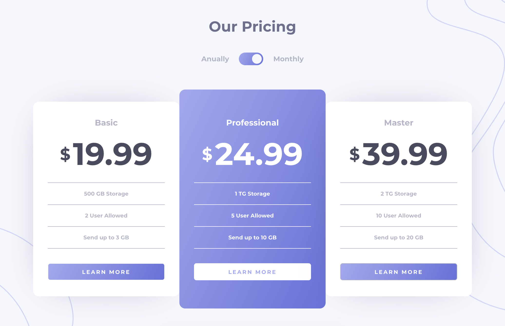

# Princing component in ReactJS

The Pricing component is a challenge from the Frontend Mentor platform! :)

## My Goals:
- [x] Studying React Hooks;
- [x] Studying React State (useState);
- [x] Studying CSS3 Flexbox;
- [x] Creating React Components;
- [x] Responsive layouts;
- [x] Design patterns;
- [x] Styled Components;

**You can see the live demo and give feedbacks on my [FrontendMentor's profile page](https://www.frontendmentor.io/solutions/pricing-component-with-toggle-in-reactjs-mshtKXv5F).**
